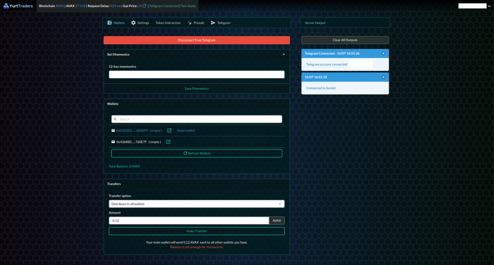
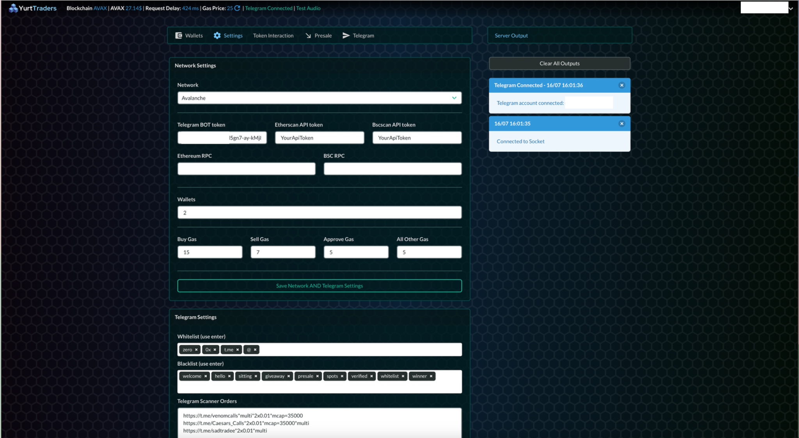
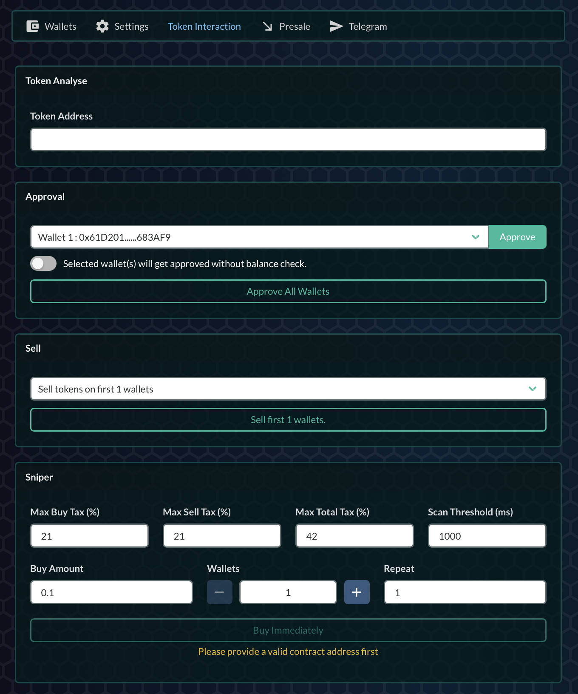

# YurtTraders

YurtTraders is an advanced cryptocurrency trading bot that scrapes Telegram channels for real-time market intelligence and automated trading execution across multiple blockchain networks. However, I initally wrote it for myself just for BNB Chain use. Then my friends wanted to use it and I removed some hardcodded values and made it more user friendly. The thing is I have no time to main this project anymore and I think it contains many useful codes that many people can reuse. Feel free to add stuff.

☢️ THE CODE IS VERY MESSY, SORRY ABOUT THAT ☢️
This project actually started as a short python script. I have never intented to complicate things this much but we were in best times of blockchain and made a bank thanks to this project. So I developed it, added many features so fast and kind of lost the discipline.

## Table of Contents

1. [Features](#features)
2. [Project Structure](#project-structure)
3. [Installation](#installation)
4. [Configuration](#configuration)
5. [Usage](#usage)
6. [Telegram Integration](#telegram-integration)
7. [Trading Capabilities](#trading-capabilities)
8. [Security Considerations](#security-considerations)
9. [Contributing](#contributing)
10. [Disclaimer](#disclaimer)
11. [License](#license)

## Features

- Multi-network support (BSC, Ethereum, Avalanche, etc.)
- Automated Telegram channel monitoring
- Intelligent message analysis and token detection
- Configurable trading parameters
- Multi-wallet management
- Web-based control panel
- Honeypot detection
- Customizable gas strategies


## Project Structure
```
.
├── data/
│   ├── doge_factory.json
│   ├── doge_router.json
│   ├── etc_factory.json
│   ├── etc_router.json
│   ├── pair_abi.json
│   ├── TJ_factory.json
│   ├── TJ_router.json
│   ├── token_abi.json
│   ├── uni_factory.json
│   └── uni_router.json
├── sessions/
├── static/
├── users/
├── venv/
├── yurt-traders-client/
├── app.py                     # Main Flask app
├── bot_relations.py           # Handles bot relationships
├── bsc_blockchain.py          # BSC blockchain interactions
├── cipher.py                  # Encryption and decryption operations
├── config.py                  # Configuration file
├── connection.py              # Connection management
├── database.py                # Database operations
├── operations.py              # General operations
├── telegram_bot.py            # Telegram bot script
├── user.py                    # User-related operations
└── wallet.py                  # Wallet-related operations
```


## Installation

1. Clone the repository:
   ```
   git clone https://github.com/yourusername/yurttraders.git
   cd yurttraders
   ```

2. Create a virtual environment:
   ```
   python -m venv venv
   source venv/bin/activate  # On Windows use `venv\Scripts\activate`
   ```

3. Install dependencies:
   ```
   pip install -r requirements.txt
   ```
4. Set enviroment variables in root directory '.env':
    ```
    TELEGRAM_API_ID = ""
    TELEGRAM_API_HASH = ""
    ```
5. Run the application:
   ```
   python app.py
   ```


## Configuration

Additional configuration is done through the web interface after launching the application.

## Usage

1. Access the web interface at `http://localhost:3059` (default port)
2. Log in or create an account
3. Configure network settings, Telegram groups, and trading parameters
4. Telegram will send a verification code enter the code USING TERMINAL
4. Start the bot and monitor its activity through the dashboard

## Telegram Integration

YurtTraders offers sophisticated Telegram integration features:

### Blacklist and Whitelist Filtering
- **Blacklist**: Prevents the bot from reacting to messages containing specific blacklisted words.
- **Whitelist**: Ensures the bot only reacts to messages containing specific whitelisted words.

### Group Monitoring and Signal Detection
- **Listening to Multiple Groups**: The bot can monitor multiple Telegram groups simultaneously.
- **Recursive Message Analysis**: Performs recursive searches within group history to find relevant contract addresses or links.

### Automated Group Joining
- **Public and Private Group Links**: Detects and joins new groups via public or private Telegram invite links.
- **Recursive Searches in Joined Groups**: Performs recursive searches within newly joined groups.

### Message Handling and Decryption
- **Morse Code and XOR Decryption**: Handles and decrypts messages encoded in Morse code or XOR encryption.
- **Important Message Detection**: Triggers alerts for messages containing high-priority keywords.

### Writing Buy Settings for Telegram Groups

The `listen` string contains the parameters for the Telegram groups the bot should monitor. Each group can have specific buy settings, formatted as follows:

#### Format
```
group_link*param1*param2*...*paramN
```

#### Parameters
- **multi**: Enables multi-wallet trading.
- **alarm**: Triggers an alarm for important messages.
- **any**: Buys tokens from any message.
- **max**: Sets a maximum transaction limit.
- **single**: Buys only a single token from the group.
- **honeypot**: Enables honeypot checks.
- **1p**: Buys up to 1% of the token's supply.
- **quarterp**: Buys up to 0.25% of the token's supply.
- **portal**: Enables portal mode for message processing.
- **mcap=X**: Sets a market cap limit of `X`.
- **wallets=X**: Specifies the number of wallets to use.

#### Example
```
https://t.me/group1*2x0.01*mcap=35000*any*alarm*multi
https://t.me/group2*1x0.05*honeypot*wallets=2*multi
```


### Session Management
- **Session Persistence**: Saves and loads Telegram sessions to maintain connectivity across restarts.

## Trading Capabilities

YurtTraders provides advanced trading features:

- **Automated Buy and Sell Orders**: Executes trades based on detected signals and predefined strategies.
- **Market Cap Analysis**: Evaluates token market capitalization before trading.
- **Honeypot Detection**: Checks for potential scams or honeypot contracts.
- **Multi-Wallet Support**: Manages and trades from multiple wallets for distributed risk.
- **Customizable Gas Strategies**: Allows fine-tuning of gas prices for optimal trade execution.


### Wallets Tab
- **Set Mnemonics**: Allows users to input their 12-key mnemonics to configure their wallets.
- **Wallets Management**: Displays the list of wallets, their addresses, and balances. Users can refresh wallets and manage multiple wallets.
- **Transfers**: Enables users to distribute or collect balances across wallets and specify the amount to transfer.


### Settings Tab
- **Network Settings**: Configure network options such as network type, API tokens, RPC URLs, and gas settings.
- **Telegram Settings**: Manage Telegram settings, including whitelist and blacklist keywords and scanner orders.



### Token Interaction Tab
- **Token Analysis**: Input a token address to analyze it.
- **Approval**: Approve tokens for trading, with options for balance checks.
- **Sell**: Specify wallets and amounts to sell tokens.
- **Sniper**: Configure and execute sniper buy settings, including buy amount, wallets, and repeat settings.




## Security Considerations

- User credentials and wallet keys are stored with encryption
- Telegram sessions use MTProto encryption
- The web interface requires authentication
- Private keys are never transmitted off the device

## Contributing

Contributions are welcome! Please feel free to submit a Pull Request.

1. Fork the project
2. Create your feature branch (`git checkout -b feature/AmazingFeature`)
3. Commit your changes (`git commit -m 'Add some AmazingFeature'`)
4. Push to the branch (`git push origin feature/AmazingFeature`)
5. Open a Pull Request

## Disclaimer

This software is for educational purposes only. Cryptocurrency trading carries significant risks. Use at your own discretion and always conduct thorough research before trading.

## License

This project is licensed under the MIT License - see the [LICENSE](LICENSE) file for details.
